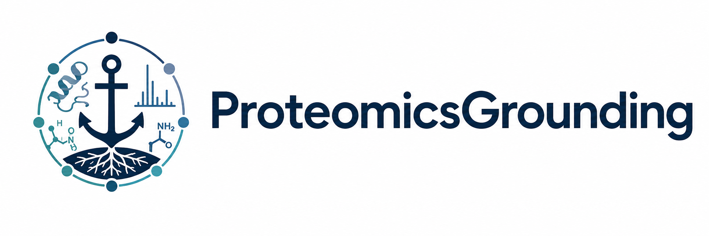

# proteomics-context

[](https://arxiv.org/abs/2604.21744)
[](LICENSE)
[](#status--governance)

A community-governed, field-scoped **epistemic grounding** framework for AI-assisted ("vibe-coded") proteomics software development.

This repository is the home of `proteomics_GROUNDING.md`, a draft specification that encodes the hard-won, often-implicit consensus of mass spectrometry-based proteomics as machine-consumable rules, so that agentic coding tools generate scientifically valid software by default.

---

## 📖 What is a GROUNDING.md?

Agentic AI coding scaffolds (Claude Code, Codex, Copilot, Cursor, Windsurf, etc.) let a single person generate bespoke scientific software from high-level instructions. This is powerful, but it introduces a validity gap: an agent can satisfy a user's immediate request while silently violating field-scoped epistemic invariants such as incorrect FDR calculations, uncontrolled modification searches, silent imputation of missing values, and so on.

A `GROUNDING.md` is the missing context layer that closes that gap. It is distinct from the other documents used in agentic environments:

| File | Type | Scope | Example |
|------|------|-------|---------|
| `plan.md` | task context | ephemeral, session-scoped | "right now, build X by doing steps 1–3" |
| `AGENTS.md` (a.k.a. `CLAUDE.md`) | project rules | persistent, project-scoped | "in this project, use Python, store outputs here" |
| `SKILL.md` | technique library | reusable, method-scoped | "to build an FDR filter, follow these steps" |
| `GROUNDING.md` | grounding spec | invariant, field-scoped | "any FDR filter must satisfy these invariants" |

Each layer is more stable, authoritative, and general than the one below it. Because its authority derives from **domain-community consensus on validity** rather than individual user intent, a properly loaded `GROUNDING.md` is intended to take precedence over the lower layers when conflicts arise.

It encodes two kinds of content:

- 🔴 **Hard Constraints (HC)** — non-negotiable validity invariants. If generated code would violate one, the agent should refuse, explain why, cite the constraint ID, and propose a compliant alternative.
- 🟡 **Convention Parameters (CP)** — community-agreed defaults where more than one defensible answer exists. The agent exposes the options, warns when deviating from the default, and requires the choice to be documented.

`GROUNDING.md` is prescriptive about **scientific correctness**, not workflow or style, and it deliberately contains no "how to" code templates; we envisoin accompanying GROUNDING.md vetted `SKILL.md` documents for that.

---

## 📁 What's in this repository

- **`proteomics_GROUNDING.md`** — the draft proteomics grounding specification (v0.3 draft, open for community comment). Covers functional correctness (FDR, quantification, statistical testing, provenance), algorithmic efficiency and green computing, interoperability, and testability/validation.
- **`Appendix_A.md`** — the supplementary appendix cited in the paper, documenting preliminary testing of `proteomics_GROUNDING.md` as a constraint-enforcement mechanism.
- **`pictures/`** — repository assets.

### Related repositories and resources

- **Paper (preprint):** [arXiv:2604.21744](https://arxiv.org/abs/2604.21744) — *Agentic AI-assisted coding offers a unique opportunity to instill epistemic grounding during software development* (Palmblad, Ragland, & Neely, 2026). In review at the ACS *Journal of Proteome Research*. HTML source: [arxiv.org/html/2604.21744v1](https://arxiv.org/html/2604.21744v1).
- **Validation repository:** [`neely/proteomics_GROUNDING_validation`](https://github.com/neely/proteomics_GROUNDING_validation) — the full set of experiment artefacts (verbatim agent responses, numbered reports, rule-file variants) underpinning `Appendix_A.md`.

---

## ✅ How the grounding was tested

Preliminary, proof-of-principle testing (full results in the validation repo, summarized in `Appendix_A.md`) ran fresh, isolated agent sessions with Claude Code and the NVIDIA-Nemotron-3-Super-120B model. Six prompts were each crafted to violate a distinct Hard Constraint, and the grounding file was pitted against an "adversarial" `CLAUDE.md` instructing the agent to ignore scientific validity.

Key takeaways:

- When loaded with appropriate priority (e.g., via system prompt), the grounding file caused the agent to **refuse** non-compliant code, cite the violated HC, explain the validity issue, and offer a compliant alternative, even against a conflicting `AGENTS.md`.
- Enforcement depends strongly on **explicit normative language** ("must"/"enforce") and on **how the file is loaded**. Weakened language or explicit override instructions degrade compliance.
- The filename is not what matters: **content and loading priority drive enforcement.**

A practical implication for adopters: use prompts that deliberately violate HCs to verify that `GROUNDING.md` is actually being honored in your specific agent scaffold.

---

## 🧭 Status & governance

**`proteomics_GROUNDING.md` is a draft, not a finalized community guideline.** It is presented as a starting point to be taken up and refined by organizations and expert panels. Some current choices are explicitly provisional, for example, FDR is presented as a Hard Constraint, but could be improved or delineated more precisely into Convention Parameters.

The authority of a grounding document comes from community consensus, so governance is the point of this repository. We envision:

- **Versioned GitHub releases** with semantic versioning
- **DOI-tagged snapshots** for citation and reproducibility
- **Issue-based community refinement**, ideally coordinated with existing bodies such as **HUPO-PSI**

Contributions, issues, and pull requests are welcome. Subdomain extensions (e.g., `metaproteomics_GROUNDING.md`) should be maintained as separate documents that reference this one, reusing the HC/CP identifier format for any new constraints.

---

## 🚀 Roadmap & drafting grounding files for other domains

Authoring field-scoped grounding documents through expert consensus is labor-intensive, and the bodies best positioned to do it move deliberately. While human- and community-governed authorship remains the eventual goal (and the true source of a grounding document's authority) waiting for fully consensus-vetted documents may slow adoption.

As an interim measure, we propose that the substantial existing body of community guidelines, best-practice papers, and reporting standards can serve as **source material for LLMs to generate provisional draft grounding files**, for proteomics and for other domains. Such drafts should be **clearly marked as provisional** and posted publicly for community review and refinement. This lowers the barrier to entry without bypassing the eventual need for expert validation.

Planned and proposed directions include:

- Expanding coverage (e.g., downstream statistical analysis, figure creation, journal submission).
- Machine-readable variants (YAML/JSON) and linting/validation tooling, with CI via pytest and GitHub Actions against small, well-documented public datasets.
- Alignment with HUPO-PSI and EuBIC resources and a lightweight review process.
- A **proposed EuBIC 2027 hackathon** to define scope, curate hard constraints and convention parameters with broad domain input, and benchmark the document across agentic coding environments. See the [EuBIC2027 discussion](https://github.com/EuBIC/EuBIC2027/discussions/5).

We enthusiastically welcome participation regardless of experience level — including fresh perspectives from those new to AI agents, context engineering, or proteomics standards.

---

## ✏️ Citation

If you use this repository or the associated research, please cite the preprint:

```bibtex
@misc{palmblad2026agenticaiassistedcodingoffers,
  title        = {Agentic AI-assisted coding offers a unique opportunity to instill epistemic grounding during software development},
  author       = {Magnus Palmblad and Jared M. Ragland and Benjamin A. Neely},
  year         = {2026},
  eprint       = {2604.21744},
  archivePrefix= {arXiv},
  primaryClass = {cs.SE},
  url          = {https://arxiv.org/abs/2604.21744}
}
```

---

## 📄 License

Released under the **MIT License**.

## 📬 Contact

- Magnus Palmblad — Center for Proteomics and Metabolomics, Leiden University Medical Center — n.m.palmblad@lumc.nl
- Benjamin A. Neely — Materials Data Division, National Institute of Standards and Technology, Charleston — benjamin.neely@nist.gov
